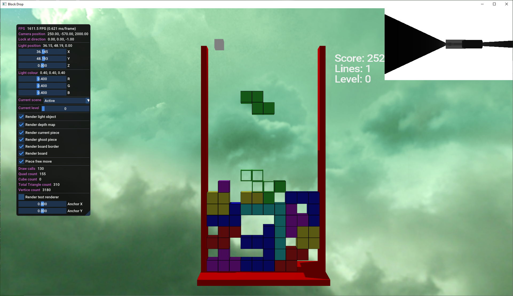
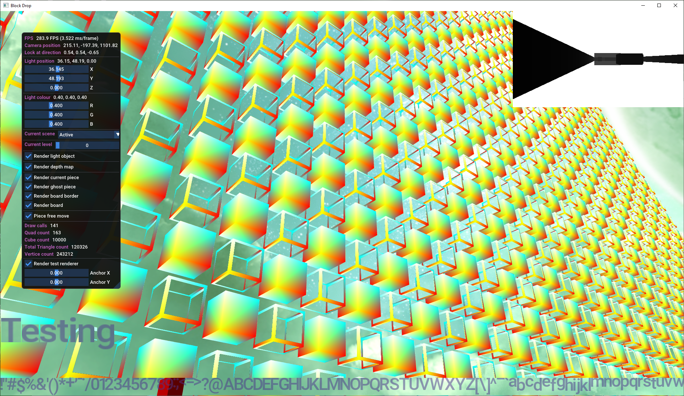

# Block Drop

## Table of contents

- [Introduction](#intro)
- [Features](#features)
- [Screenshots](#screenshots)
- [Controls](#Controls)
- [How to build](#build)
- [Libraries used](#lib)

## Introduction

A recreation of a very famous block dropping game. 

Rendered in a 3D environment using OpenGL.

## Features

- 3D visuals
- Free camera
- Texture mapping
- Blinn-Phong lighting
- Shadow mapping
- Sky box
- Batch rendering

### 3D control

### Debug mode

### Batch renderering

## Controls

### Intro Screen
- **Spacebar** - Start

### Main Game
- **Left arrow** - Move block left
- **Right arrow** - Move block right
- **Down arrow** - Move block down
- **Keypad 0** or **X** - Rotate block clockwise
- **Right CTRL** or **Z** - Rotate block anticlockwise

- **Spacebar** - Hard drop

### Game Over
- **Spacebar** - Retry

### Anytime
Free roam camera follows standard FPS controls

- **W** - Move forward
- **S** - Move back
- **A** - Move left
- **D** - Move right
- **Mouse** - Look around
- **H** - Reset view
- **Escape** -  Exit

### Debug

- **F1** - Toggle debug menu

When the debug menu is showing the mouse won't move the camera

## How to build

Everything needed is contained in this repo.

* In the root of the project create a directory called ***build***
* From the build folder run the following CMake command

` cmake .. `

` cmake --build . `

* If all goes well you'll have a solution file in the ***build*** folder and an exe built in the ***bin*** folder

## Screenshots

## Libraries used

- [OpenGL](https://www.opengl.org/)
- [GLFW ](https://www.glfw.org/)
- [Glad](https://glad.dav1d.de/)
- [GLM](https://glm.g-truc.net/0.9.9/index.html)
- [STB Image](https://github.com/nothings/stb)
- [Dear ImGui](https://github.com/ocornut/imgui)
- [FreeType](https://www.freetype.org/)